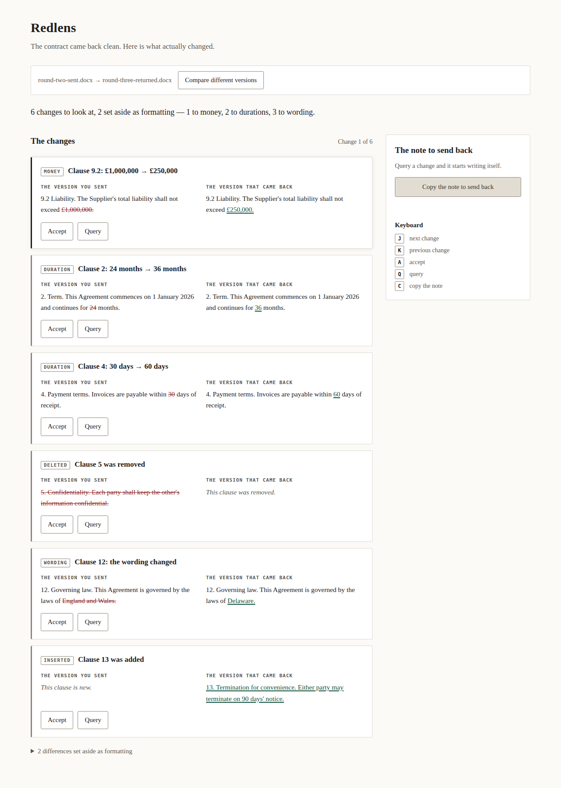
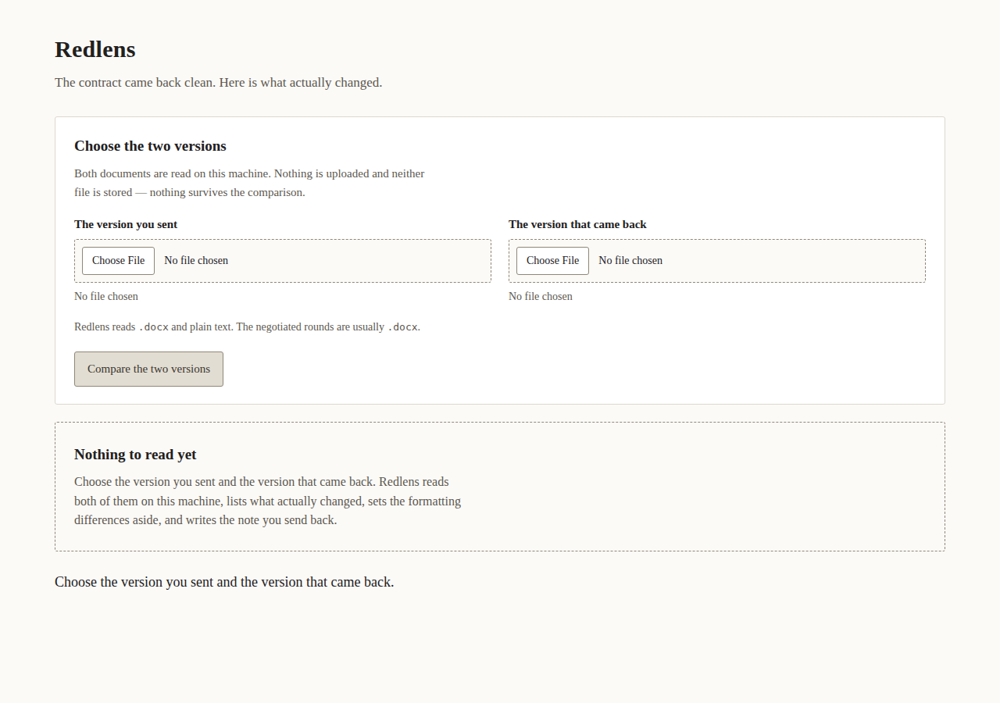

# Redlens

*[English](README.md)*

Müqavilə təmiz geri qayıtdı. Əslində nə dəyişib, budur.



## Nə edir

Göndərdiyiniz versiyanı və geri qayıdan versiyanı seçin. Redlens hər ikisini
oxuyur, əhəmiyyətli dəyişiklikləri əhəmiyyətsiz olanlardan ayırır və onların
arasından bir-bir keçirir:

> **PUL — Bənd 9.2: £1,000,000 → £250,000**
> 9.2 Məsuliyyət. Təchizatçının ümumi məsuliyyəti ~~£1,000,000~~ / £250,000-dən
> çox ola bilməz.

Dəyişikliyi qəbul edin və ya sual altına qoyun. Sual altına qoyduğunuz şey geri
göndərəcəyiniz qeydə çevrilir:

> İkinci raundu üçüncü raundla müqayisə edərkən, 2 dəyişiklik üzrə sualımız var:
>
> 1. Bənd 9.2: məbləğ £1,000,000-dan £250,000-ə dəyişib.
>    Əvvəl: "9.2 Məsuliyyət. Təchizatçının ümumi məsuliyyəti £1,000,000-dan çox ola bilməz."
>    İndi: "9.2 Məsuliyyət. Təchizatçının ümumi məsuliyyəti £250,000-dən çox ola bilməz."
>
> 2. Bənd 2: müddət 24 aydan 36 aya dəyişib.
>    …
>
> Xahiş edirik, bunların nəzərdə tutulub-tutulmadığını təsdiqləyin.

Hər iki sənəd sizin öz kompüterinizdə oxunur. Heç biri yüklənmir və heç biri
saxlanmır — müqayisədən sonra heç nə qalmır.

## Niyə mövcuddur

Danışıqları aparılmış müqavilə izlənən dəyişikliklər olmadan geri qayıdanda,
onu düzgün nəzərdən keçirməyin yeganə yolu qırx səhifəni göndərdiyiniz versiya
ilə tutuşdurmaqdır. Bunu avtomatlaşdıran alətlər proqramçılar üçün mənbə
kodunu oxumaq üzrə qurulub: onlar yerini dəyişmiş vergülü və yarıya düşmüş
məsuliyyət tavanını simvol-simvol eyni növ şey kimi göstərir — məhz bu da
redline-ı yorucu edən şeydir.

Redlens tam əks fikir üzərində qurulub: **iki müqavilə raundu arasındaki
fərqlərin çoxu bir saniyəlik diqqətinizə belə dəyməz, kiçik bir hissəsi isə
cavabınızda bir paraqrafa dəyər.** Ona görə də:

- **pulu, tarixləri, müddətləri və rəqəmləri** sözlərdən ayırır və onları bu
  qaydada sıralayır;
- əyri dırnaq işarəsini, tire işarəsini və qoşa boşluğu **formatlaşdırma**
  kimi qəbul edir — sükutla atılmır, açıla bilən sayğaçla kənara qoyulur;
- əlavə edilmiş və ya silinmiş bənd zamanı paraqrafları **əvvəlcə bənd
  nömrəsinə görə** uyğunlaşdırır, ona görə 5-ci bəndin silinməsi ondan
  sonrakı hər şeyi qarışdırmır;
- iki fayl **eyni sənədin versiyaları olmadıqda** yüz mənasız tapıntı
  yaratmaq əvəzinə bunu açıq şəkildə bildirir.

## İşə salınması

Python 3.10 və ya daha yenisi. Heç bir asılılıq yoxdur, quraşdırma addımı
yoxdur, quraşdırma tələb olunmur.

```
python run.py
```

Sonra <http://127.0.0.1:3300/> ünvanını açın.

Başqa port istifadə etmək üçün:

```
REDLENS_PORT=4300 python run.py
```

Və ya `config.json`-u redaktə edin. `config.example.json` hər ayarı göstərir.

## Nəyi oxuyur

| Format | Oxuyur |
|---|---|
| `.docx` (Word 2007 və sonrası) | Bəli — danışıqlı raundlar məhz bu formatda gəlir |
| `.txt`, `.md`, sadə mətn | Bəli |
| `.doc` (Word 97–2003) | Xeyr — Word-də açıb `.docx` kimi saxlayın |
| PDF | Xeyr — PDF adətən danışığın imzalanmış sonudur, raundu deyil |
| Skan edilmiş və ya şəkli çəkilmiş səhifələr | Xeyr — şəkildə müqayisə edilə biləcək mətn yoxdur |

Redlens bunlardan hansına baxdığını və nə etmək lazım olduğunu susmadan
bildirir.

## İstifadəsi

| Düymə | Nə edir |
|---|---|
| `J` / `↓` | növbəti dəyişiklik |
| `K` / `↑` | əvvəlki dəyişiklik |
| `A` | cari dəyişikliyi qəbul et |
| `Q` | sual altına qoy |
| `C` | qeydi kopyala |

Qəbul etmək və ya sual altına qoymaq növbəti dəyişikliyə keçir, ona görə bütün
baxış siçana toxunmadan `Q`, `A`, `A`, `Q`, `C` şəklində edilə bilər.



## Nə dəyişiklik hesab olunur

Əyri dırnaq işarələri, tirelər, ellipsislər, qırılmayan boşluqlar və ardıcıl
boşluqlar birləşdirildikdən və böyük-kiçik hərf fərqi nəzərə alınmadıqdan
sonra iki versiya eyni olarsa, paraqraf **kosmetik** hesab olunur. Qalan hər
şey **əhəmiyyətli**dir və növünə görə bildirilir:

- **pul** — `£1,000,000 → £250,000`
- **müddət** — `24 ay → 36 ay`
- **tarix** — `1 yanvar 2026 → 1 mart 2026`
- **rəqəm** — yuxarıdakılardan heç birinə aid olmayan göstərici
- **söz** — paraqraf dəyişib, amma içindəki heç bir dəyər dəyişməyib

Pul, müddət və ya tarix dəyişikliyi paraqrafı izah etdikdə, onun içindəki
sadə rəqəmlər ayrıca bildirilmir: dörd tapıntı əvəzinə bir tapıntı.

**Əlavə edilmiş** və ya **silinmiş** bəndlər ayrıca bildirilir, çünki yeni
bənd redaktə edilmiş bənddən fərqli növ hadisədir.

## Nə etmir

- Dəyişikliyin qəbuledilən olub-olmadığını demir. Bu sizin qərarınızdır və
  yaratdığı qeyd fikir deyil, sual toplusudur.
- İzlənən dəyişiklikləri, şərhləri və formatlaşdırmanı oxumur — yalnız
  sənəddə yazılanı oxuyur.
- PDF-ləri açmır və skan edilmiş səhifələr üzərində təxmin etmir.
- Şəbəkəyə toxunmur. Kodda heç bir klient növü yoxdur və səhifə brauzerin
  xaricə sorğu göndərməsini qadağan edən siyasətlə xidmət edilir.

## Məxfilik

Müqavilələr insanların iş gördüyü ən məxfi sənədlərdir, ona görə də:

- hər iki fayl yalnız `127.0.0.1`-ə göndərilir və bir sorğunun müddəti üçün
  yaddaşda saxlanılır;
- diskə heç nə yazılmır — verilənlər bazası, keş və nə müqayisə etdiyinizin
  jurnalı yoxdur;
- səhifə `Content-Security-Policy: default-src 'self'; connect-src 'self'`
  ilə xidmət edilir, ona görə səhifə cəhd etsə belə brauzer müqaviləni
  hər yerə göndərə bilməz;
- server yalnız loopback ünvanını dinləyir.

## Limitlər

| Limit | Standart | Ayar |
|---|---|---|
| Fayl ölçüsü | 20 MB | `max_document_bytes` |
| Açılmış sənəd | 128 MB | sabit |
| Sənəddəki paraqraf sayı | 20,000 | `max_paragraphs` |
| Bildirilən dəyişiklik sayı | 2,000 | `max_changes` |

2,000 paraqraflı müqavilə redaktə edilmiş nüsxə ilə müqayisə edildikdə
təxminən 90 ms çəkir.

Zərərli sənədlər açılmır, rədd edilir: giqabaytlara qədər açılan `.docx` və
sənəd növü bəyannaməsi (DTD) daşıyan fayl — Word bunu heç vaxt yazmır və bu,
bir kilobaytı yüzlərlə megabayta çevirmək və ya kompüterinizdən fayl oxumaq
üçün istifadə oluna bilər.

## Testlər

```
python -m pytest
```

80 test: müqayisə qaydaları, qeyd, sənəd oxuyucusu (qəsdən zərərli fayllar
daxil olmaqla), HTTP API, dizayn sənədindəki üç istifadəçi hekayəsi və
`python run.py`-in yeni klondan tətbiqi həqiqətən işə saldığını yoxlayan bir
alt-proses testi.

## Lisenziya

MIT. Bax [LICENSE](LICENSE).
